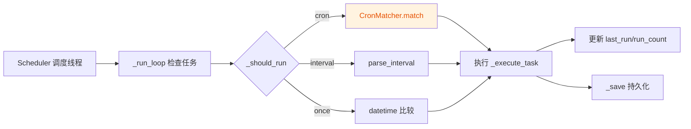

# 插件系统与 CLI 工具代码审查报告

- 审查日期：2026-07-28
- 审查人：子代理 A
- 审查方式：TRAE-code-review skill（已加载，按其流程执行手动审查与上下文取证）
- 项目路径：`d:\workspace\autodoor_behavior_tree`

## 1. 审查的文件清单

| 序号 | 文件路径 | 说明 |
|------|----------|------|
| 1 | `bt_plugins/loader.py` | 插件加载器（扫描/加载/启停/卸载、节点注册） |
| 2 | `bt_cli/scheduler.py` | 定时调度器（cron/interval/once、持久化、调度线程） |
| 3 | `bt_cli/commands/plugin.py` | CLI `plugin` 命令（list/load/start/stop/info） |
| 4 | `bt_gui/plugin_panel.py` | 插件管理 GUI 面板（仅审查，未修改） |
| 5 | `bt_gui/bt_editor/palette.py` | 节点面板动态加载插件节点 |

> 说明：`bt_gui/plugin_panel.py` 与 `bt_gui/app.py` 由子代理 B 负责，本次仅审查、不修改。

## 2. 变更概览

审查聚焦点：cron 周几匹配（已修复的严重 bug）。

## 3. 发现的问题

### 严重（Critical）

| 序号 | 问题标题 | 文件与位置 | 描述与建议 |
|------|----------|------------|------------|
| C1 | CronMatcher 周几转换逻辑错误 | `bt_cli/scheduler.py:89` | **已修复。** 原代码 `dt.weekday() if dt.weekday() != 6 else 0` 将 Python `weekday()`（周一=0..周日=6）直接当作 cron 周几（周日=0..周六=6），导致：①cron `0`（周日）同时匹配周日和周一；②cron `1`（周一）实际匹配周二；③整体偏移错误。修复为 `(dt.weekday() + 1) % 7`，符合标准 cron 约定。现有测试 `test_cron_match_range` 用 "1-5" 范围无法暴露此 bug（1 与 2 均落入 1-5 区间），故新增 `test_cron_match_weekday` 做边界验证。 |

### 警告（Warning）

| 序号 | 问题标题 | 文件与位置 | 描述与建议 |
|------|----------|------------|------------|
| W1 | Scheduler `_tasks` 字典并发访问无锁 | `bt_cli/scheduler.py:117,150,156,166,173,180,225` | `_run_loop` 在调度线程中遍历并修改任务字段（`last_run`/`run_count`），而 `add_task`/`remove_task`/`enable_task`/`disable_task`/`run_task_now` 在主线程中修改 `_tasks`。当前用 `list(self._tasks.values())` 规避了迭代期修改异常，但任务对象的字段读写仍存在数据竞争。建议引入 `threading.Lock` 保护 `_tasks` 的增删与 `_save` 调用。**未修复**（属于线程安全增强，超出"只修复严重问题"范围，避免不必要的重构）。 |
| W2 | Scheduler `_save` 并发写入可能损坏文件 | `bt_cli/scheduler.py:134-139` | `_save` 由主线程（增删任务）和调度线程（`_execute_task` 更新 `last_run`/`run_count` 后）并发调用，无锁保护，且非原子写入（直接 `open`+`json.dump`）。并发写入可能导致 `schedules.json` 损坏。建议：①加锁；②写入临时文件后 `os.replace` 原子替换。**未修复**（同 W1，需配套加锁方案）。 |
| W3 | Scheduler `_load` 静默吞掉所有异常 | `bt_cli/scheduler.py:131-132` | `except Exception: pass` 完全忽略加载错误。若 `schedules.json` 损坏或格式异常，用户无任何提示，调度任务会"悄悄丢失"。建议至少 `print` 警告信息。**未修复**（非严重功能缺陷）。 |
| W4 | `_execute_task` 未保留子进程引用 | `bt_cli/scheduler.py:196-200,203` | `subprocess.Popen(...)` 返回值未存储，无法对子进程做 `wait`/`terminate`/资源回收，且无异常处理（`cli.py` 不存在或 `python` 不在 PATH 时会抛异常未被捕获，虽在 `_run_loop` 内不会导致线程退出但会丢失本次调度）。建议保留 `Popen` 对象到列表并定期清理，并包裹 `try/except`。**未修复**。 |
| W5 | Loader 直接访问 PluginContext 私有属性 | `bt_plugins/loader.py:170-173,278,292,353` | `self._context._settings`、`self._context._message_bus`、`self._context._adapter_manager`、`self._context._service_registry` 等以单下划线命名的"私有"属性被外部直接访问。虽 Python 不强制访问控制，但破坏了封装。建议在 `PluginContext` 增加只读 property 或显式 getter。**未修复**（需改动 `base.py`，属设计层面调整）。 |
| W6 | `cmd_plugin` 构造 PluginContext 仅注入 settings | `bt_cli/commands/plugin.py:19` | `PluginContext(settings=settings)` 未注入 `message_bus`/`adapter_manager`/`service_registry`。CLI 模式下插件虽能加载启动，但 `get_adapters()`/`get_services()` 提供的能力无法真正接入主系统（loader 中 adapter_manager 为 None 时会新建孤立实例，service_registry 为 None 时仅记录归属不实际注册）。这可能是 CLI 模式的有意降级，建议在文档中明确说明。**未修复**（行为是否预期需产品确认）。 |

### 建议（Suggestion）

| 序号 | 问题标题 | 文件与位置 | 描述与建议 |
|------|----------|------------|------------|
| S1 | Loader 缺少线程安全保护 | `bt_plugins/loader.py` 全文 | `_plugins`/`_registered_nodes` 等字典无锁保护。当前插件管理通常在主线程单线程操作，风险较低；但若未来 GUI 异步刷新与用户操作并发，可能出现竞态。低优先级。 |
| S2 | `unload_plugin` 中 `on_load` 失败回滚不完整 | `bt_plugins/loader.py:179-184` | `on_load` 抛异常后仅清理 `sys.modules`，未调用任何已分配资源的清理逻辑。若插件在 `on_load` 中打开了文件/建立了连接后抛异常，会泄漏。建议约定插件在 `on_load` 失败时自行清理，或引入 `on_load_rollback` 钩子。低优先级。 |
| S3 | `plugin_panel.py` 刷新策略销毁重建卡片 | `bt_gui/plugin_panel.py:193-214` | `_refresh_list` 每次销毁全部 `PluginCard` 再重建，频繁刷新时有性能开销。可改为按 name 增量更新。属优化建议，非缺陷。 |
| S4 | `palette.py` 插件节点 section 重建逻辑可读性 | `bt_gui/bt_editor/palette.py:262-270` | `refresh_plugin_nodes` 用 `winfo_exists()` 过滤已销毁的 section，逻辑正确但可加注释说明"为何要在销毁后过滤列表"。属可读性建议。 |

## 4. 已修复的问题

| 序号 | 问题 | 修复方式 | 验证 |
|------|------|----------|------|
| C1 | CronMatcher 周几转换逻辑错误 | `bt_cli/scheduler.py:89` 将 `dt.weekday() if dt.weekday() != 6 else 0` 改为 `(dt.weekday() + 1) % 7` | 新增 `test_cron_match_weekday` 测试用例（`tests/test_scheduler.py`），全部 300 个测试通过 |

修复涉及的文件：
- `bt_cli/scheduler.py`（第 89 行）
- `tests/test_scheduler.py`（新增 `test_cron_match_weekday`）

## 5. 遗留问题

以下问题未修复，按优先级建议后续处理：

1. **W1 / W2（线程安全与持久化原子性）**：`Scheduler` 的 `_tasks` 并发访问与 `_save` 并发写入缺少锁保护，长期运行存在数据竞争与文件损坏风险。建议统一引入 `threading.Lock` 并将 `_save` 改为临时文件 + `os.replace` 原子写入。这是本次审查发现的最值得跟进的遗留项。
2. **W3（`_load` 静默吞异常）**：影响排障体验，建议加 `print` 警告。
3. **W4（子进程引用未保留）**：影响调度任务的可观测性与异常处理，建议保留 `Popen` 句柄并加 `try/except`。
4. **W5 / S2（Loader 封装与回滚）**：设计层面改进，低优先级。
5. **W6（CLI 模式 Context 注入不完整）**：需确认是否为预期降级。
6. **S1 / S3 / S4**：优化与可读性建议，非必须。
